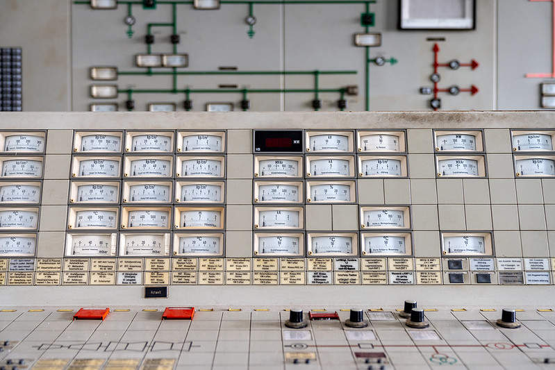
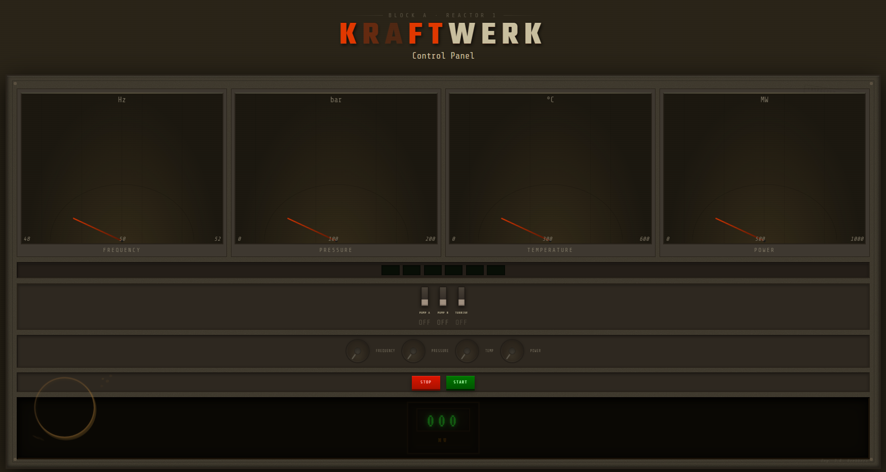

# Sources — KRAFTWERK Control Panel

## CSS Things to use??

### Core CSS Features
- [CSS Cascade & @layer — MDN](https://developer.mozilla.org/en-US/docs/Web/CSS/@layer)
- [CSS Nesting — MDN](https://developer.mozilla.org/en-US/docs/Web/CSS/CSS_nesting)
- [Container Queries — MDN](https://developer.mozilla.org/en-US/docs/Web/CSS/CSS_containment/Container_queries)
- [:target selector — MDN](https://developer.mozilla.org/en-US/docs/Web/CSS/:target)
- [CSS Custom Properties — MDN](https://developer.mozilla.org/en-US/docs/Web/CSS/Using_CSS_custom_properties)
- [CSS Grid — MDN](https://developer.mozilla.org/en-US/docs/Web/CSS/CSS_grid_layout)
- [CSS Flexbox — MDN](https://developer.mozilla.org/en-US/docs/Web/CSS/CSS_flexible_box_layout)
- [clamp() — MDN](https://developer.mozilla.org/en-US/docs/Web/CSS/clamp)

### Styling Form Elements
- [input[type="range"] — MDN](https://developer.mozilla.org/en-US/docs/Web/HTML/Element/input/range)
- [input[type="checkbox"] — MDN](https://developer.mozilla.org/en-US/docs/Web/HTML/Element/input/checkbox)
- [Styling range inputs (CSS-Tricks)](https://css-tricks.com/styling-cross-browser-compatible-range-inputs-css/)
- [:checked selector — MDN](https://developer.mozilla.org/en-US/docs/Web/CSS/:checked)

### Animations & Transitions
- [@keyframes — MDN](https://developer.mozilla.org/en-US/docs/Web/CSS/@keyframes)
- [CSS transition — MDN](https://developer.mozilla.org/en-US/docs/Web/CSS/transition)
- [cubic-bezier — MDN](https://developer.mozilla.org/en-US/docs/Web/CSS/easing-function)

---

## W3C Formal Specifications

- [CSS Cascading and Inheritance Level 5 — W3C](https://www.w3.org/TR/css-cascade-5/) *(defines @layer)*
- [CSS Containment Module Level 3 — W3C](https://www.w3.org/TR/css-contain-3/) *(defines container queries)*
- [CSS Nesting Module — W3C](https://www.w3.org/TR/css-nesting-1/)
- [CSS Custom Properties for Cascading Variables — W3C](https://www.w3.org/TR/css-variables-1/)

---

## Typography to use??

- [Orbitron — Google Fonts](https://fonts.google.com/specimen/Orbitron)
- [Share Tech Mono — Google Fonts](https://fonts.google.com/specimen/Share+Tech+Mono)
- [Titillium Web — Google Fonts](https://fonts.google.com/specimen/Titillium+Web)

---

## SVG for background elements???

- [SVG `<line>` — MDN](https://developer.mozilla.org/en-US/docs/Web/SVG/Element/line)
- [SVG `<circle>` — MDN](https://developer.mozilla.org/en-US/docs/Web/SVG/Element/circle)
- [SVG `<rect>` — MDN](https://developer.mozilla.org/en-US/docs/Web/SVG/Element/rect)
- [SVG `<text>` — MDN](https://developer.mozilla.org/en-US/docs/Web/SVG/Element/text)

---

## CSS Architecture Methodology

- [CUBE CSS methodology](https://cube.fyi/)
- [ITCSS — Inverted Triangle CSS (SmashingMagazine)](https://www.smashingmagazine.com/2022/05/you-need-css-reset/)
- [Every Layout — intrinsic layout patterns](https://every-layout.dev/)

---

## Design Inspiration

- [The uploaded photograph of an East German power station control room](https://live.staticflickr.com/65535/55045008234_0c5e94ce69_c.jpg)
- [Kraftwerk Lippendorf control room (Wikipedia)](https://en.wikipedia.org/wiki/Lippendorf_power_station)
- [Flickr: Abandoned power station control panels](https://www.flickr.com/search/?text=abandoned+power+station+control+room)

---

## Timer docs

- [timer](https://frontendmasters.com/blog/how-to-make-a-css-timer/)

## Coffee stain docs

- [Coffee stain](https://alvaromontoro.com/blog/68035/css-art-drawing-a-coffee-stain)

## Control panel ideas

- Power plant
- Space ship
- Submarine
- Nuclear missile silo
- Factory
- Steampunk machine
- Time machine
- Synthesizer

## 19 februari 2026
### What did i do today
- Gave presentation for about initiation project, and listend to other presentations.
- Math problems
- Procrastinated
- Started with base html of 1 of eecah element i plan to use
- Styled 2 of the elemnts

### how long did it take
- 2 hours
- 30 minutes
- 30 minutes
- 30 minutes
- 1,5 hours

### what did i learn
- can use > to select direct children in css.
- anchor positioning
- carrousel styling
- scroll driven animation

### what do i want to do next
- finish styling the rest of the elements

---

## 📋 Week 1 Report - Plan

### Assignment choice & options selected
A retro power plant control panel inspired byGerman nuclear plant control rooms. The concept is a fictional plant called KRAFTWERK German for "power plant". The panel includes analog gauges, toggle switches, rotary knobs, status LEDs, a power output display, and start/stop plant controls.

### Which CSS techniques will you start with?
- CSS child selectors (`>`)
- Anchor positioning (`:target` for plant on/off state)
- Carousel styling
- Scroll-driven animations

### Where do your major challenges lie?
- Making the rotary knobs work and visually rotate using only CSS and a minimal JS range bridge (no logic JS)
- Connecting knob values to gauge needles purely through CSS custom properties
- Making the panel feel authentically aged and physical without images
- Keeping everything responsive while maintaining the dense instrument-panel layout

### Reference images

[Reference link 2](https://www.flickr.com/photos/192959875@N05/55045013694/in/pool-controlpanel/)

[Reference link 3](https://www.flickr.com/photos/192959875@N05/55045006854/in/pool-controlpanel/)

### Initial breakdown sketch
Components planned:
- Header / logotype (KRAFTWERK title plate)
- Instrument gauges × 4 (Frequency, Pressure, Temperature, Power)
- Status LEDs × 6
- Toggle switches × 3 (Pump A, Pump B, Turbine)
- Rotary knobs × 4
- START / STOP plant controls
- Power output scroll display (MW readout)

---

## 4 march 2026
### What did i do today
- Styled the rest of the elements
- Styled the entire page
- Made the page responsive
- Made overload warning
- Made the dials work

### how long did it take
- 30 minuits
- 3 hours
- 30 minuits
- 30 minuits
- 30 minuits

### what did i learn
- how to make things work with css only
- how to make a page responsive with css only
- how to make a overload warning with css only
- how to make dials work with css only

### what do i want to do next
- add animations to the page
- figure something out for what the control panel is controlling.

## 5 march 2026
### What did i do today
- Added animations to the page
- Made 2 different style pages to see what i like better
- Made better power output animation
- Made the overload warning more flashy

### how long did it take
- 1 hour
- 2 hours
- 1 hour
- 30 minuits

### what did i learn
- How to work with only css to do things that would normally be done with javascript

### what do i want to do next
- figure something out for what the control panel is controlling.
- add more animations to the page

---

## 📋 Week 2 Report - Progress 

### Progress so far
This week the bulk of the visual work came together. All elements got styled, the page became fully responsive, and key interactive pieces like the dials and overload warning were implemented using pure CSS. Two style variants were made to compare directions.

### What went smoothly?
- Styling individual elements once the base HTML was in place went quickly 
- Making the page responsive with CSS only worked out well
- The overload warning and dial mechanics came together without needing JavaScript

### What was challenging?
- Getting the dials to behave correctly with CSS alone
- Deciding between the two style variants
- The full page styling took significantly longer than individual components

### Experiments that 'failed'
- Tried to randomize the starting values of the range inputs (knobs) using CSS alone, but CSS has no random capabilities that can set initial input values.

### New insights into the power of CSS
- CSS alone can handle things typically reserved for JavaScript, such as interactive dials, responsive layouts, and conditional warnings
- CSS-only interactivity requires thinking differently about state (`:checked`, `:hover`, `@keyframes`, etc.)

### Changes to initial plan
- Still figuring out what the control panel is actually controlling — this remains open

### Challenges for next week
- Deciding on a narrative/concept for what the control panel controls
- Adding more animations

---

## 11 march 2026

### What did i do today
- Changed the styling of the title and made verythign english
- Made some easter eggs

### how long did it take
- 1 hour
- 3 hours

### what did i learn
- How to use different type of ways for colors to use gradients.

## 12 march 2026
### What did i do today
- file restructuring

### how long did it take
- 4 hours

---

## 📋 Week 2 & 3 Report — Progress (Part 2)

### Progress so far
This week was more about polish and hidden details. The title got a visual overhaul, everything was translated to English, and easter eggs were added. A significant amoutn of time went into restructuring files.

### What went smoothly?
- Adding easter eggs was creative and fun, even if time-intensive
- Title restyling came together within an hour

### What was challenging?
- File restructuring took a full 4 hours.

### Experiments that 'failed'
- I wanted to add sound effects to the control panel using only CSS, but this is not possible as CSS has no audio capabilities.

### New insights into the power of CSS
- Color syntax variety (hex, hsl, oklch, etc.) opens up more flexible and dynamic gradient possibilities

### Challenges for next week
- Finalising and polishing everything for completion

---

## 18 march 2026
### What did i do today
- Made the title more "Sensational"

### how long did it take
- 2,5 hours

---

## 📋 Week 4 Report — Completion

### Final result
KRAFTWERK is a fictional German power plant control panel built almost entirely in CSS. Styled as an aged instrument panel. The title drops in letter by letter on load, each letter occasionally getting overcharged and looking distorted.

The panel includes analog gauges, toggle switches, rotary knobs, status LEDs and a retro scroll-drum MW power output display. All controls are fully interconnected — switches kill their related gauges and LEDs, knobs only respond while the plant is running, and turning a switch off mid-run triggers an orange warning flash. Maxing all four knobs while running triggers a full meltdown: red EMERGENCY overlay, screen shake and a flickering power display.

Hidden details include a coffee cup ring stain, an engineer engraving, an 
inspection stamp and a plant name that fades in on title hover.

### What went smoothly?
- The title animation/styling.

### What was challenging?
- File restructuring (week 3) was unexpectedly time-consuming
- Making the title more "sensational" took a lot of trial and error to get the timing and effects right, especially the overload distortion.

### What are you most proud of?
- I am most proud of the title animation and styling, as well as the overall cohesiveness of the control panel design and interactivity.

### New insights into the power of CSS
- CSS can replace a surprising amount of JavaScript for UI interactivity when you think in terms of state via input elements and pseudo-classes